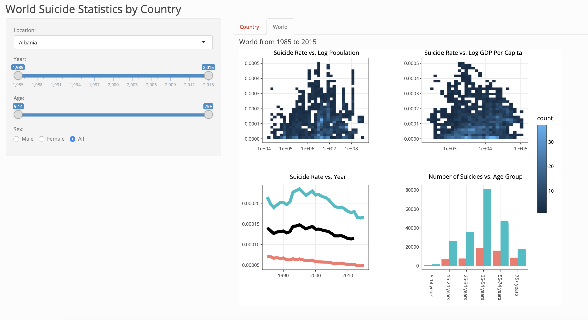

# Using Suicide Statistics to Identify at Risk Groups
[Wilson Deng](https://github.com/xiaoweideng), [Rayce Rossum](https://github.com/RayceRossum)

This app is published on shinyapps.io. Our deployed Shiny App can be found [here](https://raycer.shinyapps.io/SuicideStatistics/).

## Overview

As the media reports increases in suicide rates, mental health initiatives are becoming more prevelant around the world. Being able to understand factors that influence suicide rates in different countries would allow these initiatives to improve their outreach and save more lives. In order to address this problem, we propose a data visualization app that allows mental health initiatives to visually explore various visualizations over a variety of factors. Our app will use a combination of world and country maps and distribution charts to provide this information.

## Dependencies

- R Version 3.5.1

- R libraries:
    - `shiny` Version 1.2.0
    - `shinyWidgets` Version 0.4.0
    - `shinythemes` Version 1.1.2
    - `tidyverse` Version 1.2.1
    - `gridExtra` Version 2.3
    - `plotly` Version 4.8.0

## Releases

[Milestone 1 v0.1](https://github.com/UBC-MDS/DSCI_532_Suicide_Statistics/tree/v0.1)

[Milestone 2 v0.2](https://github.com/UBC-MDS/DSCI_532_Suicide_Statistics/tree/v0.2)

[Milestone 3 v0.3](https://github.com/UBC-MDS/DSCI_532_Suicide_Statistics/tree/v0.3)

## Feedbacks
[Issue 1](https://github.com/UBC-MDS/DSCI_532_Mental-health-survey-Tech/issues/12)

[Issue 2](https://github.com/UBC-MDS/DSCI532_Davy_Reza/issues/6)

## Screenshot of App

