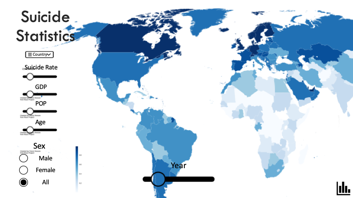
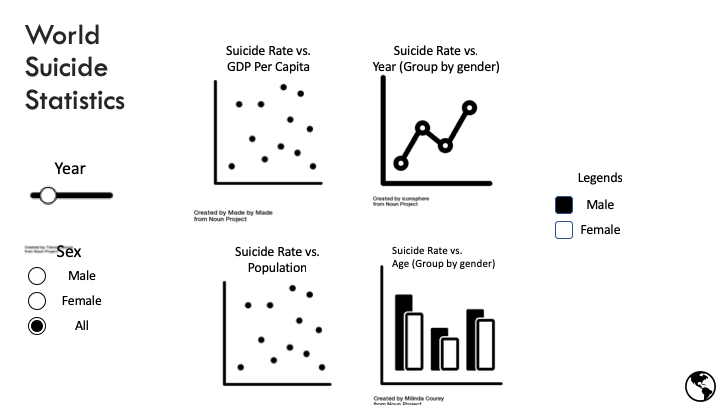

# Milestone 1: Using Suicide Statistics to Identify at Risk Groups
#### Wilson Deng, Rayce Rossum

## Section 1: Overview
As the media reports increases in suicide rates, mental health initiatives are becoming more prevelant around the world. Being able to understand factors that influence suicide rates in different countries would allow these initiatives to improve their outreach and save more lives. In order to address this problem, we propose a data visualization app that allows mental health initiatives to visually explore various visualizations over a variety of factors. Our app will use a combination of world and country maps and distribution charts to provide this information.

## Section 2: Description of the data
We will be visualizing a combination of two datasets. One from the WHO on Suicide Statistics and the other from the UN on GDP per capita. The WHO dataset contains basic categories such as *country*, *year*, *sex*, *age* and information such as number of suicides (*suicides_no*) and *population*. The UN dataset will be used to augment the WHO dataset with information on GDP per capita (*value*). To accomplish this we will join on *Country or Area* and	*Year*. The WHO dataset has data from the years 1979-2016, while the UN dataset has data from the years 1970-2015.

Selected data approved by @alejandra.

## Section 3: Usage scenario & tasks
The health organization of Canada has noticed an increase in suicide rates over the last 10 years. Wilson has been assigned to investigate the possible factors leading to this increase. He wants to [explore] the data in order to [compare] the effects over different variables such as *time*, *sex*, and *age*. This will allow Wilson to [identify] the relevant factors need to target his Mental Health initiatives to the identified groups.

When Wilson logs into his "Suicide Statistics" app he will be greeted with a world map that he can travel around. Along the bottom, he'll see a slider which he can use to scroll through different years. Wilson can filter different variables such as *age group*, *sex*, *population*, and *gdp*. In doing so, Wilson may identify that as the population of Canada grew, young male suicide rates increased. Wilson may then want to compare this to another country with similar statistics (*gdp*, *population*) in order to gauge whether there may be other influencing factors. By comparing the similar suicide rates to that of Australia, he hypothesizes that as Canada has grown over time and it's GDP has increased, suicide rates have also done the same. Wilson uses this information to target his new initiative towards young men and researches methods that Australia has used which had success.

## Section 4: Description of app & sketch

The home page of the shiny app contains a global heat map which shows the distribution of suicide rate across the world. On the bottom of the page, there is a slider that can adjust which year of data you're viewing. The main control panel is on the left third of the page. There are a variety of sliders and radio buttons which allow users to filter out and change variables on the main display. Moreover, there is a dropdown menu which can filter countries. Once users select a country from the menu, the app will direct users to a subpage that shows the distribution (bar chart, line chart) of dataset factors (year, suicide rate etc) based on the selected country. Further, there is an :earth_americas: icon on the bottom right corner of the home page which directs users to another subpage. On this subpage, there are plots (scatter plot, line chart) that show global trends and relations between factors. Lastly, users can click on the :bar_chart: icon on the bottom right corner of the subpage to go back to the home page.

