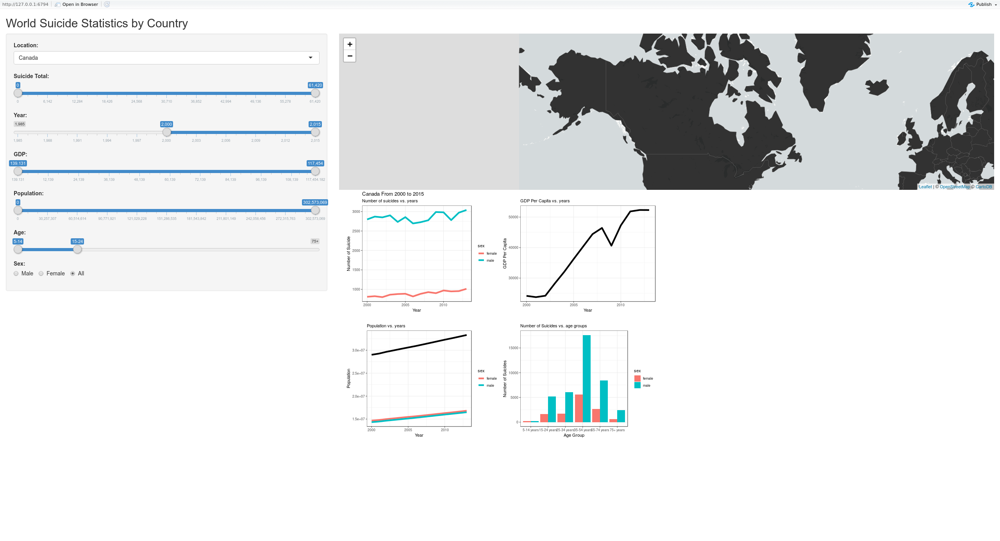

# Milestone 2:First submission of an app
#### Wilson Deng, Rayce Rossum

#### Deployment of app (shinyapps.io)

#### Screenshots of the draft app

### Rationale
Our design choices were built with specific countries in mind. We wanted our users to be able to select their own country and see all the information they need out of it at a glance in order to make an informed decision about which groups to target.

Along the left hand side we have filters for various data:
  - Country (Dropdown Text Selector [allCountries])
  - Year (Date Range [minYear - maxYear])
  - GDP (Integer Range [minGDP - maxGDP])
  - Population (Integer Range [minPop - maxPop])
  - Age (Age Group Range [5-14, 15-24, 25-34, 35-44, 45-64, 64-75, 75+])
  - Sex (Radio Selector [Male, Female, All])

A map is included which allows users to browse to their specific country but also to scroll and see comparisons with their neighbours. The colour of the map is meant to depend on the number of total suicides within that country dependent on the factors specified in the filters.

Our plots also update dependent on our filters. Showing the suicide trend over the range selected, the country's GDP trend, population growth and total number by age group. This gives a good at a glance representation about what has been changing in the given country over time and how the suicide rate is affected.

### Tasks

- Build Control Panel
  - Make the inputs interactive with the map and plots
  - Modify the range of sliders

- Build and optimize the heat map

- Data wrangling
  - Make data ready for the plots

- Create plots
  - Select the appropriate plot types
  - Indicate titles and axises

### Vision & Next Steps

In our proposal, we planned to make the app with multiple pages but we decided to place everything on one page for now and implement this for the next milestone.

### Bugs

- Map only reacts to changes in country
- Plot only reacts to changes in years and country

### Changes since proposal

As R provides simple interfaces for making sidebars we abandoned the idea of a full screen map with plots on seperate pages in favor of a more compartmentalized design. As we think that the users of our app care about the trends and relations within a specific country, we've placed them on the main page. Another thing we have changed is the slider of "Suicide Rate" to "Suicide Total" because the "Suicide Rate" is actually a very small number and it cannot represent any interesting data by itself. Only when compared to other data does it become a relevant factor. 
