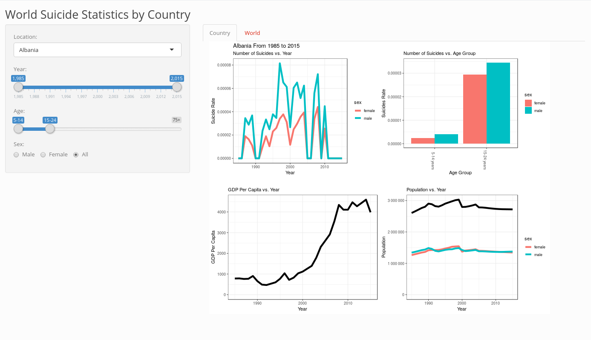
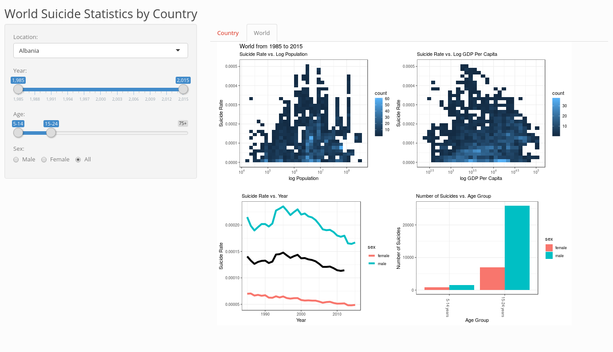

# Milestone 3
#### Wilson Deng, Rayce Rossum

#### Deployment (shinyapps.io)

https://raycer.shinyapps.io/SuicideStatistics/

#### Screenshots

#### Reflection

Our app was straightforward to use for our peers. Although many were confused by the map and tried to click on it in order to select a country which would have been a nice feature. Our reviewers both commented on the map adding confusion and ultimately being unnecessary. It was mentioned that our controls weren't fully functional in our application as well.

#### Changes

First and foremost, we removed the map. It was confusing and did not have a clear use case. Our next step was making sure our plots were fully reactive to our controls. We did not address some minor feedback such as adding legend labels due to time constraints and instead focused our effort on improving macro level features.

#### Feedback

As our application was not fully functional I feel we lost out on more of the design feedback as our users were focused more on what didn't work than what did work. Being a fly on the wall was nice, and gave insight into our application which lead to the map removal. "Hidden" or non-obvious functionality was a major sticking point.
